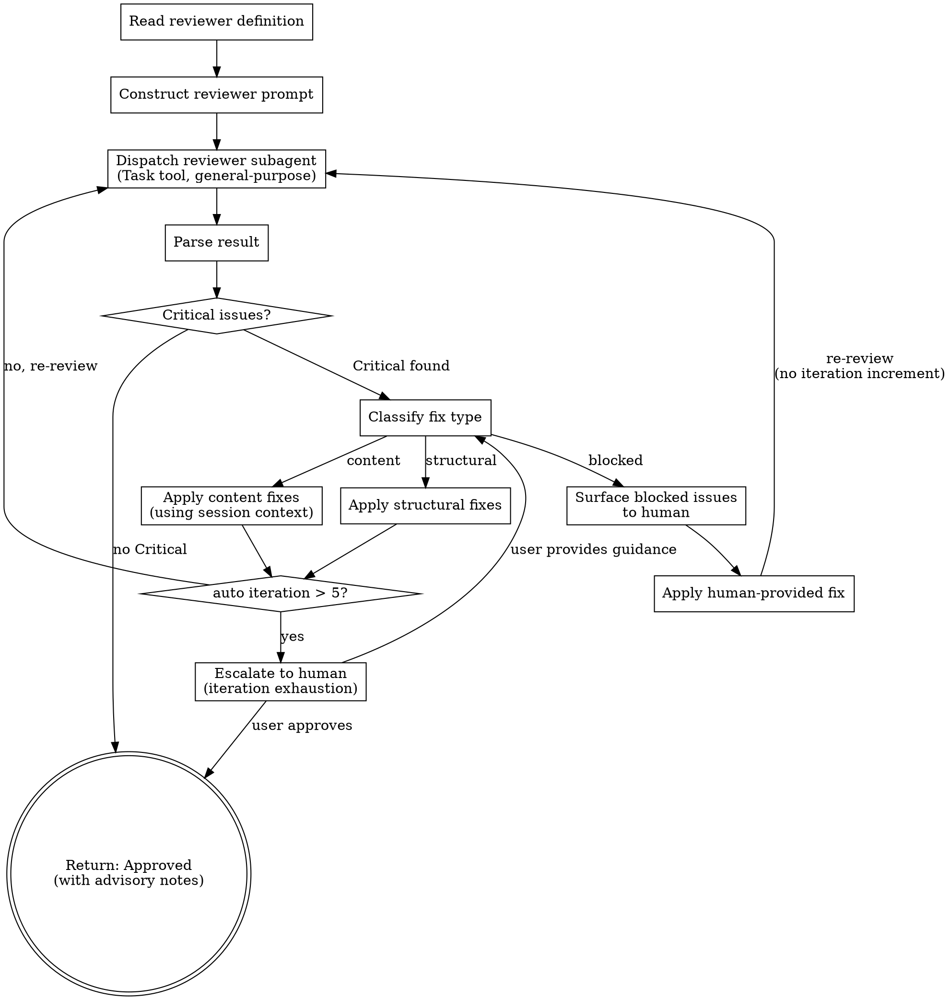

<SUBAGENT-STOP>
如果你是作为 subagent 被分派到此文件，请立即停止。review-loop 必须在调用方的 session 中运行（通过 Skill tool 调用），而非作为隔离的 subagent 执行。请将此信息返回给调用方。
</SUBAGENT-STOP>

# Review-Loop：通用 Review 引擎

review-loop 是一个通用的 review 循环引擎，由其他 skill 在运行时调用。它不直接面向用户——当 brainstorming、writing-plans 或任何配置了 review gate 的 skill 需要对产出物进行质量审查时，它们会 invoke review-loop 来执行审查流程。

**核心职责：**

- 读取 reviewer 定义文件，构建标准化的审查 prompt
- 通过 Task tool 分派 reviewer subagent（隔离环境）
- 解析审查结果，按 severity 分类处理
- 管理 fix-review 循环，直到通过或需要人工介入

**关键设计原则：**

- review-loop 在**调用方的 session 中运行**（通过 Skill 调用），保留完整的上下文
- Reviewer 作为**隔离的 subagent** 运行（通过 Task tool），仅接收 prompt 中提供的信息
- 每次调用都是**无状态的**——iteration 计数不会跨调用保留
- 同一 session 中的多次调用（如 writing-plans 的逐 chunk 审查）彼此独立

---

## Inputs

调用方通过对话上下文提供以下输入：

| Input | Required | 说明 |
|-------|----------|------|
| **Artifact** | Yes | 待审查文件的路径 |
| **Reviewer** | Yes | `skills/review-loop/reviewers/` 中的 reviewer 定义名称 |
| **Scope** | No（默认审查整个文件） | 聚焦区域，如 `"Chunk 2"` 仅审查该部分 |
| **References** | 当 reviewer 定义了引用时必须提供 | 命名引用，与 reviewer 的 `References` 部分对应，如 `spec: path/to/spec.md` |

---

## Process Flow

以下是完整的 review 循环流程：



**Iteration 计数规则：** 仅自动修复（structural 和 content）会递增 iteration 计数器。Human-provided fixes（blocked issues 的人工修复）**不计入**——人工介入属于「获取必要信息」，而非修复失败。5 次 iteration 上限仅追踪自动 fix-review 循环，用于检测 agent 是否陷入死循环。

---

## Step-by-Step Instructions

### Step 1: Read Reviewer Definition

从 `skills/review-loop/reviewers/<name>.md` 读取 reviewer 定义文件（使用 Read tool）。

从中提取以下关键部分：

| 部分 | 用途 |
|------|------|
| **Purpose** | reviewer 的角色定位，用于构建 prompt 的 Role 部分 |
| **References** | reviewer 需要的命名引用列表，用于 Step 2 校验 |
| **Dimensions** | 审查维度表（Category / What to Look For / Severity），作为审查指引 |
| **Critical Signals** | reviewer 必须重点关注的信号列表 |
| **Pass Criteria** | 通过标准（Auto-approve / Flag / Advisory 规则） |

### Step 2: Validate Inputs

执行以下校验，任一失败则终止并报错：

1. **Artifact 文件存在** — 使用 Read tool 确认文件可读
2. **Required references 已提供** — 如果 reviewer 定义了 References，调用方必须提供对应的路径
3. **Reference 文件存在** — 确认每个 reference 路径指向可读文件

校验失败时的错误信息见 [Error Handling](#error-handling) 部分。

### Step 3: Construct Reviewer Prompt

将 reviewer 定义与调用方输入组合为完整的 reviewer prompt。Prompt 结构如下：

```
┌──────────────────────────────────────────────────────────────┐
│  Constructed Prompt（发送给 reviewer subagent）                │
│                                                               │
│  1. Role: "You are a [purpose] reviewer."                    │  ← 来自 reviewer 定义
│  2. Artifact: "Read and review this file: [path]"            │  ← 来自调用方输入
│     (+ Scope: "Focus on [Chunk N] only" if scoped)           │  ← 来自调用方输入
│  3. References: "Also read [name]: [path]" (for each)        │  ← 来自调用方输入
│  4. Dimensions table (with severity column)                   │  ← 来自 reviewer 定义
│  5. Critical signals list                                     │  ← 来自 reviewer 定义
│  6. Output format（标准化，hardcoded in engine）：              │  ← 来自 engine
│                                                               │
│     ## Review Result                                          │
│     **Status:** ✅ Approved | ❌ Critical Issues Found         │
│                                                               │
│     **Critical Issues:** (must fix)                           │
│     - [location]: [issue] - [impact]                          │
│                                                               │
│     **Important Issues:** (should fix, advisory)              │
│     - [location]: [issue] - [impact]                          │
│                                                               │
│     **Minor Issues:** (nice to have, advisory)                │
│     - [location]: [issue] - [impact]                          │
│                                                               │
│     **Recommendations:**                                      │
│     - [suggestions]                                           │
│                                                               │
└──────────────────────────────────────────────────────────────┘
```

**Output format 是固定的**，不随 reviewer 定义变化。循环的解析逻辑依赖一致的输出结构。

**关于 Severity 的重要说明：**

- Dimensions 表中的 Severity 列是**指引而非硬约束**。Reviewer 以此为建议基线，但可根据实际影响程度覆盖。
- 例如：一个配置为 Important 的「Architecture」维度，如果 reviewer 发现了根本性的边界违反，可以将其提升为 Critical。
- 不匹配任何预定义 dimension 的 issue 默认为 Important。
- 循环的 approval 逻辑**完全基于 reviewer 的最终输出**，而非 Dimensions 表的配置。

**关于 Scoped review：**

当提供了 Scope（如 `"Chunk 2"`）时，prompt 指示 reviewer 仅审查该部分。Scope 通过**子字符串匹配 `##` 标题**来定位。Reviewer 读取完整文件，但仅审查匹配标题下的内容（直到同级或更高级标题为止）。

**关于 Artifact 访问：**

Reviewer subagent 使用自己的文件读取工具（Read、Grep 等）访问 artifact 和 reference 文件。Prompt 传递的是**路径而非内联内容**，保持 prompt 精简并允许 reviewer 自由导航大型文件。

### Step 4: Dispatch Reviewer Subagent

使用 **Task tool** 分派 reviewer subagent：

- **Type:** `general-purpose`
- **Prompt:** Step 3 中构建的完整 prompt
- 等待 subagent 返回结果

Reviewer 在隔离环境中运行，没有当前 session 的上下文——它只能访问 prompt 中提供的信息和文件路径。

### Step 5: Parse Result

从 reviewer 返回的结果中提取结构化信息：

1. **查找 Status 行** — 确认 `✅ Approved` 或 `❌ Critical Issues Found`
2. **按 severity 提取 issues** — 分别收集 Critical、Important、Minor 列表
3. **收集 Recommendations** — 作为 advisory 信息

**处理 malformed output：**

如果 reviewer 的输出无法解析（缺少 Status 行、格式不符合预期）：

- **第 1 次：** 重新分派 reviewer subagent，在 prompt 中附加格式提醒
- **第 2 次：** 如果仍然 malformed，将原始输出展示给人工处理

### Step 6: Evaluate Result

根据解析结果决定下一步：

- **No Critical issues** → 审查通过（Approved）。Important 和 Minor issues 作为 advisory 报告给调用方。流程结束。
- **Critical issues found** → 需要修复。进入 Step 7 对每个 Critical issue 进行分类。

### Step 7: Classify Fix Type

**由 review-loop agent 自行分类**每个 Critical issue 的修复类型。Reviewer 不需要指定修复类型——它只报告 issues 和 severity。修复策略是 review-loop engine 的内部关注点。

分类依据：

| Fix Type | 信号特征 | 行动 | 示例 |
|----------|---------|------|------|
| **Structural** | 格式问题、TODO 标记、占位符文本、结构不一致、缺少 section 标题 | 直接修复——机械性修正 | 移除 TODO、修复格式、重组 section |
| **Content** | 覆盖不足、分析不完整、推理缺陷、细节不够 | 利用 session 上下文修复——agent 保留了父 skill 的完整对话上下文和领域理解 | 补充缺失的错误处理讨论、使用 brainstorming 中的设计决策扩展不完整的 section |
| **Blocked** | 需要 session 中不可获得的信息（外部 API 文档、用户偏好、agent 缺乏的领域知识） | 将具体问题展示给人工，说明需要什么信息 | 「Section X 需要关于认证提供商的详细信息——我没有这些信息」 |

**review-loop 不做的事情：** 重写 artifact 的核心设计决策或引入新的架构选择。如果 reviewer 表示「所选方案存在根本性缺陷」，这属于 blocked issue——应由人工（或父 skill 的设计流程）来处理。

### Step 8: Apply Fixes

根据 Step 7 的分类，分别处理：

**Structural fixes（结构性修复）：**

- 直接在 artifact 文件中进行机械性修正
- 使用 Edit tool 修复格式、移除 TODO 标记、调整结构
- 修复完成后，递增 iteration 计数器，返回 Step 4 重新审查

**Content fixes（内容修复）：**

- 利用当前 session 中的上下文信息修复内容缺陷
- 你拥有父 skill 的完整对话历史——用户的需求、设计决策、探讨过的替代方案
- 这些上下文足以处理大多数内容修复
- 修复完成后，递增 iteration 计数器，返回 Step 4 重新审查

**Blocked fixes（阻塞修复）：**

- 将具体问题展示给人工用户，清楚说明：
  - 哪个 issue 被阻塞
  - 需要什么信息才能修复
  - 你已经尝试了什么
- 等待人工回应
- 收到回应后，应用人工提供的修复
- **不递增 iteration 计数器**——返回 Step 4 重新审查

### Step 9: Check Iteration Count

在每次自动修复（structural 或 content）后检查 iteration 计数：

- **iteration <= 5：** 继续循环，返回 Step 4 重新审查
- **iteration > 5：** 触发人工升级（escalation）

**人工升级流程：**

向用户展示完整的 issue 历史和当前状态，提供以下选项：

1. **Continue** — 用户提供指导，按指导修复后继续循环（回到 Classify fix type）
2. **Approve with known issues** — 接受当前状态，以已知问题的形式通过审查
3. **Abort** — 终止 review 流程

---

## Disagreement Handling

| 情况 | 处理方式 |
|------|---------|
| Agent 同意 reviewer 的反馈 | 修复并重新审查 |
| Agent 不同意 reviewer 的反馈 | 修复时附加对分歧的说明，重新审查 |
| 同一 issue 持续 3 次 iteration | 展示给人工裁决 |
| Reviewer 输出格式错误（malformed） | 附加格式提醒重新分派 |
| Reviewer 输出格式错误 x 2 | 展示给人工处理 |

---

## Completion Output

review-loop 完成时，向对话中写入结构化摘要，供调用方 skill 获取结果。

**审查通过时：**

```
✅ Review approved for [artifact path] using reviewer [name].
   [N] iteration(s). Advisory: [Important/Minor issues summary, if any].
```

**升级时：**

```
⚠️ Review escalated for [artifact path] using reviewer [name].
   [N] iteration(s). User chose: [approve with known issues / continue / abort].
```

这是 review-loop 的「返回值」——由于 review-loop 在同一 session 中运行，调用方 skill 直接从对话上下文中读取结果。

---

## Error Handling

| 错误 | 处理方式 |
|------|---------|
| Reviewer definition not found | `"Reviewer 'X' not found in review-loop/reviewers/. Use setup-review to create it."` |
| Artifact file not found | `"Cannot review 'path' — file does not exist."` |
| Reference not provided (but required) | `"Reviewer 'X' requires reference 'name'. Provide the path."` |
| Reviewer output unparseable | 附加格式提醒重新分派。2 次失败后展示给人工 |
| Loop exceeds 5 iterations | 展示完整 issue 历史给人工。提供选项：continue / approve with known issues / abort |
| Scope section not found in artifact | `"Chunk 'N' not found in 'path'. Available sections: [list]"` |
