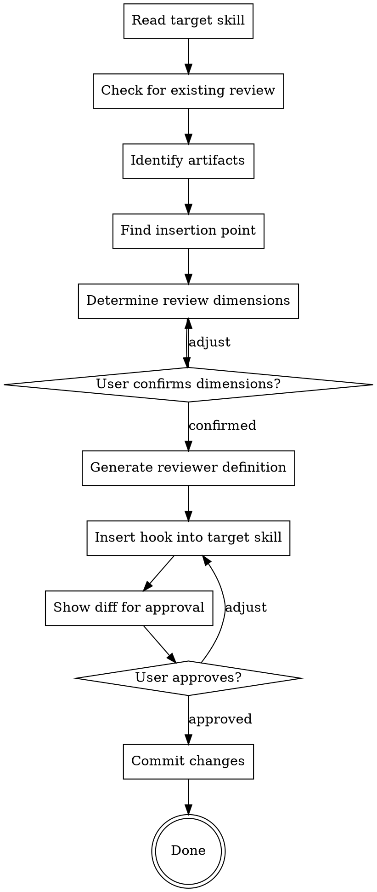

# Setup-Review：为任意 Skill 添加 Review 能力

setup-review 是一个一次性的 Meta Skill（元技能），用于为现有的任意 skill 添加自动化 review 能力。当用户说"为 my-custom-skill 添加 review"时，此 skill 会引导整个配置过程：分析目标 skill、生成 reviewer 定义文件、在目标 skill 中插入最小化的 hook。

**开始时宣告：** "I'm using the setup-review skill to add review capability to [target skill]."

**核心流程：**

- 读取并分析目标 skill → 生成 reviewer 定义 → 插入 review gate hook
- 所有变更需用户确认后才提交
- 完成后目标 skill 即可在运行时自动调用 review-loop 进行质量审查

---

## Process Flow



---

## Step 1: Read Target Skill

读取目标 skill 的 SKILL.md，识别以下关键信息：

| 分析项 | 说明 |
|--------|------|
| **产出物（artifacts）** | 该 skill 生成的文件、文档或配置 |
| **"完成"位置** | 产出物在流程中何时算"写好了"——这是 hook 的插入点 |
| **现有 review 机制** | 是否已有 `review-loop` hook 或内联 review 逻辑 |
| **Terminal action** | skill 流程的终止动作（如调用下一个 skill、交付用户等）——hook 必须在此之前 |

### 重复 Review 检测

如果目标 skill 已包含 `review-loop` hook 或内联 review loop，发出警告：

> "This skill already has review capability. Proceeding would create duplicate reviews. Continue?"

仅在用户明确确认后继续。

---

## Step 2: Identify Artifacts

确定需要被 review 的产出物。关注以下信号：

- 向 `docs/`、`specs/`、`plans/` 等已知输出目录写入文件
- 带有日期戳的文件命名模式（如 `YYYY-MM-DD-<topic>-design.md`）
- 配置生成或代码生成步骤
- 流程中描述为"save"或"commit"产出物的步骤

识别后，向用户确认：

> "This skill produces [artifact description]. Is this what you want reviewed?"

---

## Step 3: Find Insertion Point

确定 review gate hook 在目标 skill 中的插入位置。按优先级依次尝试：

### 方式 1：显式标记（Primary）

在目标 skill 的 SKILL.md 中查找 `<!-- review-point -->` 标记。如找到，直接在该位置插入 hook。这是最可靠的方式——skill 作者可以预先标记 review 应该发生的位置。

### 方式 2：启发式分析（Fallback）

如果没有显式标记，分析 skill 的结构：

1. **找到产出物写入步骤** — 查找关键词：`Write to`、`Save to`、`Create file`、`Commit`
2. **找到 terminal action** — 下一个 skill 调用、用户交付等
3. **在两者之间插入** hook

### 方式 3：用户指定（Last Resort）

如果启发式分析也无法确定位置，直接询问用户：

> "Where in the skill's flow should the review gate go? (Before which step?)"

---

## Step 4: Determine Review Dimensions

根据产出物类型，提议 review 维度及其 severity 级别：

| Artifact Type | Suggested Dimensions |
|---------------|---------------------|
| Design spec | Completeness (C), Coverage (C), Consistency (C), Clarity (I), YAGNI (I), Scope (C), Architecture (C) |
| Implementation plan | Completeness (C), Spec Alignment (C), Task Decomposition (I), File Structure (I), Task Syntax (M) |
| API definition | Completeness (C), Consistency (C), Naming (I), Versioning (I), Error Handling (C), Security (C) |
| Configuration | Completeness (C), Correctness (C), Security (C), Documentation (I) |
| Generated code | Correctness (C), Style (I), Testing (C), Security (C) |

*(C = Critical, I = Important, M = Minor)*

将建议的维度表呈现给用户确认。用户可以：

- **添加**新的维度
- **移除**不需要的维度
- **调整** severity 级别
- **修改**具体的审查信号描述

反复调整直到用户确认。

---

## Step 5: Generate Reviewer Definition

在 `skills/review-loop/reviewers/` 下创建 reviewer 定义文件。

### 命名规则

| 规则 | 示例 |
|------|------|
| **默认：** 使用 `<target-skill-name>.md` | `brainstorming` skill → `reviewers/brainstorming.md` |
| **用户偏好：** 如果用户倾向使用领域名称 | 用户指定 `spec-completeness` → `reviewers/spec-completeness.md` |

### 文件结构

遵循 `skills/review-loop/reviewers/_template.md` 中的标准模板格式：

```markdown
# <Domain> Reviewer

**Purpose:** <用一句话描述此 reviewer 验证的内容>

## References

- **<name>**: <此引用是什么的简要说明>

## Dimensions

| Category | What to Look For | Severity |
|----------|------------------|----------|
| <维度 1> | <具体的审查信号> | Critical |
| <维度 2> | <具体的审查信号> | Important |
| <维度 3> | <具体的审查信号> | Minor |

## Critical Signals

- <信号 1>
- <信号 2>

## Pass Criteria

- **Auto-approve when:** No Critical issues found
- **Flag when:** Any Critical issue exists
- **Advisory:** Important and Minor issues are reported but do not block approval
```

根据 Step 4 中用户确认的维度填充 Dimensions 表，并为每个 Critical 维度生成对应的 Critical Signals 条目。

---

## Step 6: Insert Hook

在 Step 3 确定的插入点处，将 review gate hook 写入目标 skill 的 SKILL.md。

### Hook 格式变体

根据 reviewer 需求选择合适的格式：

**基础格式（无 References）：**

```markdown
**Review gate:** After writing [artifact description], invoke review-loop skill with:
- **Reviewer:** `<reviewer-name>`
- **Artifact:** the written file path
```

**带 References 格式：**

```markdown
**Review gate:** After writing [artifact description], invoke review-loop skill with:
- **Reviewer:** `<reviewer-name>`
- **Artifact:** the written file path
- **References:** `spec`: path to the design spec
```

**带 Scope 格式（逐 chunk 工作流）：**

```markdown
**Review gate:** After writing each chunk, invoke review-loop skill with:
- **Reviewer:** `<reviewer-name>`
- **Artifact:** the plan file path
- **Scope:** the current chunk (e.g., "Chunk 1")
- **References:** `spec`: path to the design spec
```

### 更新 Process Flow 图

如果目标 skill 包含 Process Flow dot graph，在产出物写入节点和下一步骤之间添加 Review gate 节点：

```dot
"Write artifact" -> "Review gate" [label="invoke review-loop"];
"Review gate" -> "Next step" [label="approved"];
```

---

## Step 7: Show Diff and Commit

### 变更摘要

向用户展示所有变更的完整摘要：

| 变更类型 | 文件 | 描述 |
|----------|------|------|
| **新建** | `skills/review-loop/reviewers/<name>.md` | Reviewer 定义文件 |
| **修改** | `skills/<target>/SKILL.md` | 插入 review gate hook（+ dot graph 更新，如适用） |

### 审批与提交

1. 等待用户审阅并批准变更
2. 如用户要求调整，返回 Step 6 修改 hook 或返回 Step 5 修改 reviewer 定义
3. 用户批准后，将两个文件一起提交：

```
feat: add review gate to <skill-name>
```

---

## Error Handling

| 错误场景 | 处理方式 |
|----------|----------|
| 目标 skill 已有 review hook | 警告重复风险，询问用户是否继续 |
| 无法识别产出物 | 询问用户："What artifact should be reviewed?" |
| 无法确定插入位置 | 询问用户："Where should the review gate go?" |
| 无 `<!-- review-point -->` 标记且启发式分析失败 | 直接询问用户指定位置 |
| Reviewer 名称与现有文件冲突 | 建议替代名称，或询问用户是否覆盖现有定义 |
